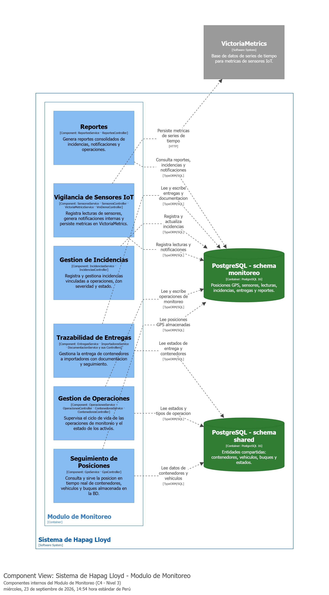

# Leyenda del modelo C4 — Sistema de Hapag Lloyd

## 1. Qué muestra cada figura

### Contexto (C4 - Nivel 1)

Muestra el sistema completo como una sola caja y su relación con el mundo exterior. Se identifican dos roles de usuario: el **Operador de Gestión de Operaciones Marítimas**, que gestiona rutas, buques e incidencias; y el **Operador de Monitoreo**, que supervisa posiciones GPS y sensores en el mapa. Los sistemas externos son **OpenStreetMap / ArcGIS** (proveedor de tiles de mapa consumidos directamente desde el browser), **VictoriaMetrics** (base de datos de series de tiempo para métricas de sensores IoT) y **Sensores IoT / GPS** (dispositivos que reportan posición y métricas de activos).

---

### Contenedores (C4 - Nivel 2)

Abre el sistema y muestra las piezas que se ejecutan o almacenan datos de forma separada. El **Frontend** (Next.js 16 / React 19) es la interfaz web con mapa interactivo vía Leaflet. Dentro del backend existen dos módulos NestJS desplegados en el mismo proceso: el **Módulo de Monitoreo** y el **Módulo de Gestión de Operaciones Marítimas**. El almacenamiento está en un único servidor **PostgreSQL 16** organizado en tres schemas: `monitoreo`, `shared` y `gestion_maritima`, representados como contenedores separados por ser dominios de datos independientes.

---

### Componentes del Módulo de Monitoreo (C4 - Nivel 3)

Abre el **Módulo de Monitoreo** y muestra las seis responsabilidades internas que lo componen:

- **Seguimiento de Posiciones**: consulta posiciones GPS de contenedores, vehículos y buques almacenadas en la BD.
- **Gestión de Operaciones**: supervisa el ciclo de vida de las operaciones de monitoreo y el estado de los activos.
- **Vigilancia de Sensores IoT**: registra lecturas de sensores, genera notificaciones internas y persiste métricas en VictoriaMetrics.
- **Gestión de Incidencias**: registra y gestiona incidencias con severidad y estado.
- **Trazabilidad de Entregas**: gestiona la entrega de contenedores a importadores con documentación asociada.
- **Reportes**: genera reportes consolidados de incidencias, notificaciones y operaciones.

---

## 2. Qué se dejó afuera a propósito

El sistema real contiene otros módulos NestJS (`auth`, `gestion_portuaria`, `gestion_reserva`, `operaciones_terrestres`, `personal_tripulacion`) que **no se modelaron** porque el análisis de esta semana se enfoca únicamente en los módulos de **Monitoreo** y **Gestión de Operaciones Marítimas**. Incluirlos habría agregado ruido al diagrama sin aportar al objetivo del ejercicio.

El módulo de **Autenticación** (`auth`) tampoco aparece como contenedor porque, aunque existe en el backend y todos los endpoints lo usan, es una dependencia transversal y no una pieza con dominio de datos propio que aporte al análisis de los dos módulos seleccionados.

Los schemas `gestion_portuaria` y `gestion_reserva` de PostgreSQL se omitieron por la misma razón.

---

## 3. Observaciones del equipo revisor

_(Completar luego de la revisión cruzada con el equipo asignado)_

---

## 4. Observación del equipo

Al dibujar el diagrama de componentes del **Módulo de Monitoreo** se notó que el componente de **Vigilancia de Sensores IoT** es el único que tiene una dependencia directa hacia un sistema externo (VictoriaMetrics) además de la base de datos. Esto significa que si VictoriaMetrics no está disponible, solo ese componente se ve afectado: los demás cinco componentes del módulo siguen operando con normalidad sobre PostgreSQL. Esta separación no era evidente leyendo el código directamente — solo se hizo visible al forzar que cada componente declarara sus propias dependencias en el diagrama.
